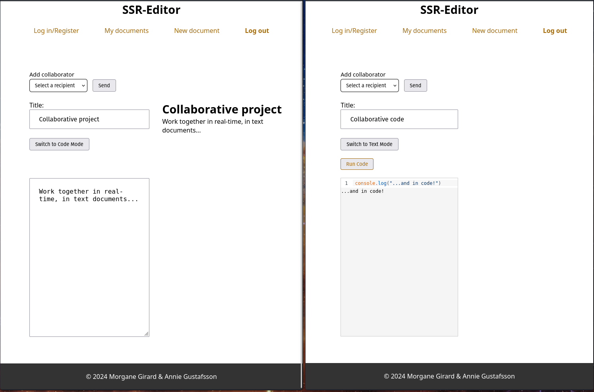

---
# SSR Editor - Frontend



## Introduction
**SSR Editor** is the frontend component of a collaborative text editor application, created as part of the **jsramverk course assignment**. This web application is built with **React** and utilizes **Server-Side Rendering (SSR)** for improved performance. The frontend is hosted on a student server.

## Features
- **Real-Time Document Editing**: Collaborate with other users in real time.
- **User Authentication**: Secure login and registration with JWT-based authentication.
- **Document Sharing**: Share documents with others and manage access permissions.
- **Email Invitations**: Invite both registered and unregistered users to edit documents.

## Technology Stack
- **React** for the user interface
- **Socket.IO** (optional) for real-time collaboration

### Installation
1. Clone the repository:
   ```bash
   git clone https://github.com/MoRosGi/jsramverk_frontend.git
2. npm install
3. npm run start

### Project Structure
```
src/
├── components/       # Reusable UI components
├── models/           # Utility functions
└── App.js            # Router and main app component
```
### Contributors
- **Developers**: Annie Gustafsson and Morgane Girard.

